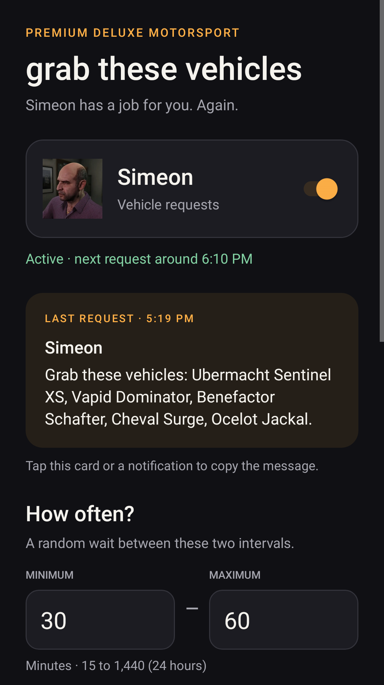
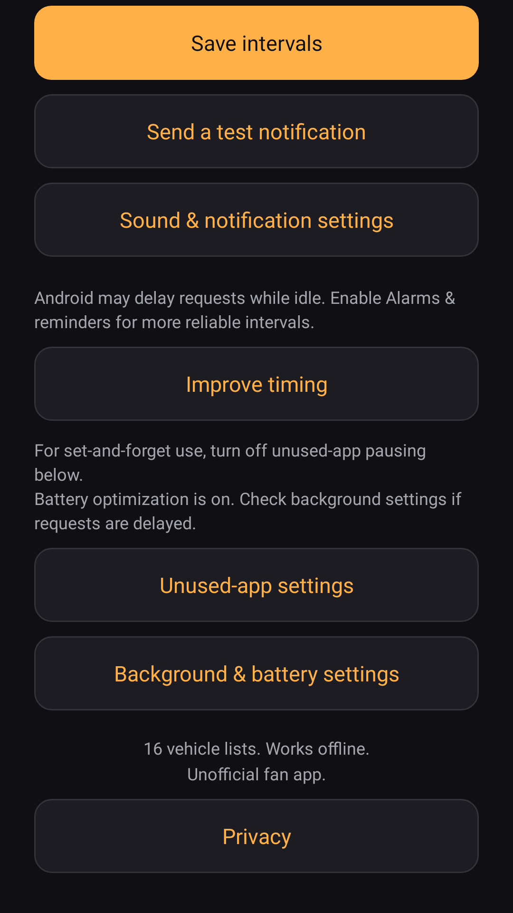

<p align="center">
  
</p>

# grab these vehicles

Simeon has a job for you. Again.

A native Android fan app that sends random **“Grab these vehicles”** notifications
with five-vehicle lists, Simeon's portrait, and the GTA notification chime.
Works offline. No ads, accounts, analytics, or internet permission.

**[Download version 1.3 for Android](downloads/grab-these-vehicles-v1.3.apk?raw=1)**

Requires Android 8 or newer. The release APK uses the same package and signing
certificate as earlier personal releases, so it can update those installations.

## Features

- Random **30–60-minute** waits by default; adjustable from 15 to 1,440 minutes.
- All **16 documented English request texts**, shuffled without immediate repeats.
- Tap a notification to copy its exact text, or tap the latest-request card in the app.
- Bundled GTA notification sound and a direct button for Android's sound,
  vibration, and notification settings.
- Pause/resume and an immediate test notification.
- Elapsed-time alarms, reboot restoration, and hourly background alarm recovery.
- Background, battery, unused-app, and privacy guidance in the app.

## One-time setup

1. Install the release APK and open the app once.
2. Allow notifications and send a test notification.
3. For more reliable timing on Android 12+, use **Improve timing** to allow
   **Alarms & reminders**. Approximate scheduling works without that access.
4. On Android 11+, use **Unused-app settings** and disable **Pause app activity
   if unused** (or **Remove permissions if app isn't used**).
5. If requests arrive late, use **Background & battery settings** to allow
   background activity. On OnePlus, check App battery management.

Android can delay alarms and jobs under power restrictions. A force-stopped or
hibernated app cannot run until Android permits it again. Reopen after a force stop.
Notifications run throughout the day and night. Android silent mode, notification
volume, and Do Not Disturb still apply.

## Screenshots

App previews rendered from the Android view hierarchy.

<table>
  <tr><th>Latest request</th><th>Settings</th></tr>
  <tr>
    <td></td>
    <td></td>
  </tr>
</table>

## Build from source

Use **JDK 21**, **Android SDK 36**, and **build-tools 36.0.0**. The Gradle wrapper
is included. The app is plain Java with no runtime dependencies.

```sh
./gradlew testDebugUnitTest assembleDebug lintDebug
```

The development APK is `app/build/outputs/apk/debug/app-debug.apk`.
Development builds use your local Android debug key; they cannot update the
published APK unless signed with its original key.

Release builds are unsigned unless you supply all four environment variables:

| Variable | Value |
| --- | --- |
| `GTV_KEYSTORE_FILE` | Path to your private keystore, outside the repository |
| `GTV_KEYSTORE_PASSWORD` | Keystore password |
| `GTV_KEY_ALIAS` | Signing key alias |
| `GTV_KEY_PASSWORD` | Signing key password |

```sh
./gradlew assembleRelease bundleRelease lintRelease
```

Keep keystores and credentials private. The repository does not include the
original release signing key.

A dependency-free SDK build is also available with JDK 17 or newer and Python 3:

```sh
ANDROID_HOME=/path/to/android-sdk python3 tools/build_apk.py
```

Without release-signing variables, this generates an ignored local development
key and writes `app/build/standalone/outputs/grab-these-vehicles-debug.apk`.
With all four variables, it signs with your supplied key and writes
`grab-these-vehicles.apk` in that output directory.

## Verification

The version 1.3 release passed 30 Robolectric Android behavior cases, release lint
with no errors, APK signature/alignment verification, and App Bundle validation.
Tests cover clipboard actions, settings navigation, recovery, reboot and clock
changes, notification-channel migration, and read-only sound access on Android 8
and Android 16. Interval and message checks include 100,000 random waits.

```sh
sh tools/test_policy.sh
```

GitHub Actions runs the policy checks, Android behavior tests, development build,
and lint without requiring release-signing credentials. Its uploaded development
APK is separate from the signed release download.

The new version's background behavior still needs physical-device verification;
the sound implementation was previously confirmed working on OnePlus.

## Google Play

Google Play publication is pending. `play-release/` includes listing text,
graphics, release notes, verification details, and a privacy-policy draft.
The draft needs publisher contact details before hosting or submission.

## Credits

The app's code uses the GPL-3.0 license selected for this repository. See
[LICENSE](LICENSE). Third-party game assets retain their respective rights.

This is an unofficial fan app, not affiliated with or endorsed by Rockstar Games
or Take-Two Interactive. Game text, imagery, and audio belong to their respective
rights holders. See [SOURCES.md](SOURCES.md) for asset provenance and Android references.
