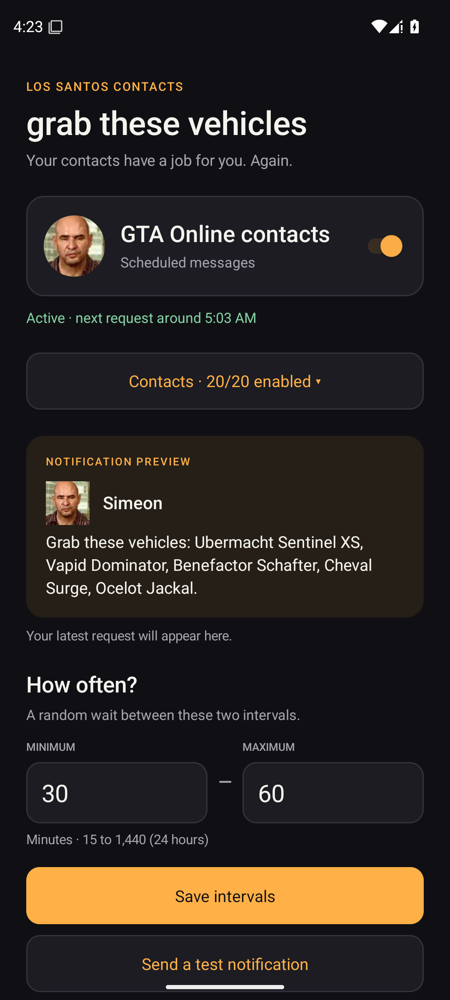
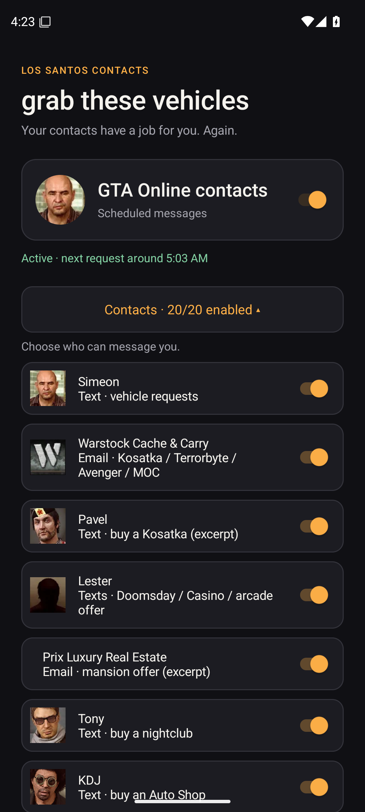
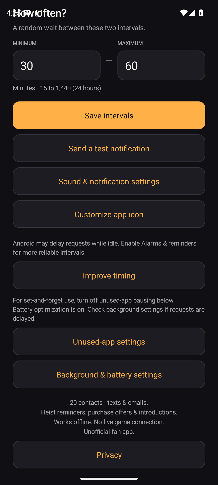
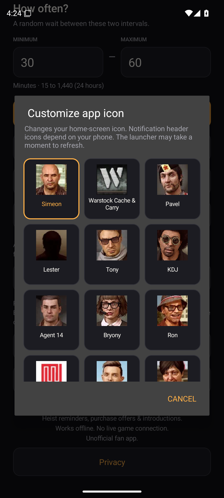
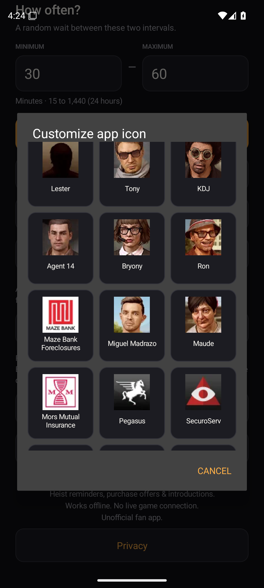
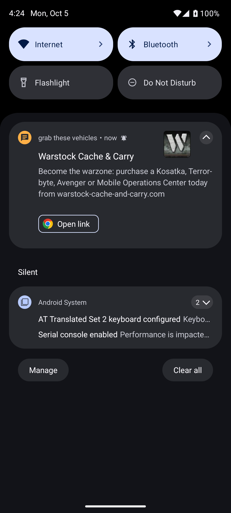

<p align="center">
  
</p>

# grab these vehicles

Your contacts have a job for you. Again.

A native Android fan app with **20 contacts** and the GTA notification chime.
Simeon's 16 vehicle lists remain available. Added messages are verified in-game
phone texts or emails: heist/planning reminders, purchase offers, and introductions.
Longer messages use exact short excerpts. Optional simulated calls replay original character voice recordings.
Messages are simulated offline with no live game connection.
See [SOURCES.md](SOURCES.md) for provenance.

Contacts: Simeon, Warstock Cache & Carry, Pavel, Lester, Prix Luxury Real Estate,
Tony, KDJ, Agent 14, Bryony, Ron, Maze Bank Foreclosures, Miguel Madrazo, Maude, Mors Mutual Insurance, Pegasus, SecuroServ, Franklin, Lamar, Gerald,
and Junk Energy.
Lester includes the Doomsday planning reminder, arcade purchase offer, and Casino
planning invitation. Pavel includes the Kosatka purchase text. Warstock's email
covers the Terrorbyte, Kosatka, Avenger, and MOC.
Gerald introduces stash houses and G’s Caches; Lamar introduces LD Organics.
Franklin invites you to Record A Studios. Pegasus confirms vehicle availability.
Dom’s Online introductions are calls, so the skydiving text uses its actual
sender, Junk Energy. Each of the 20 senders has an individual toggle.
Works offline. No ads, sign-in, analytics, or internet permission. Optional native calls create a separate local GTA caller account for contact pictures and ringtone settings.

**[Download for Android](https://github.com/rgbeans/grab-these-vehicles/releases)**

Requires Android 8 or newer. The release APK uses the same package and signing
certificate as earlier personal releases, so it can update those installations.

## Features

- Optional incoming calls, **off by default**, with a separate 30–60-minute timer.
- Your existing Phone app displays incoming calls, with the bundled GTA ringtone, native Answer/Decline controls, and automatic hang-up after the recording. Playback uses call volume and native audio routing. No microphone recording or outgoing calls.
- **31 genuine GTA Online phone calls from 24 callers**, offering missions, businesses, and services. Import a local recording or replace a bundled voice.
- Independent caller toggles and call intervals. Original portraits include Paige and the Mechanic.

- Random **30–60-minute** waits by default; adjustable from 15 to 1,440 minutes.
- All **16 documented English request texts**, shuffled without immediate repeats.
- Tap a notification to copy its exact text, or tap the latest-request card in the app.
- Bundled GTA notification sound and a direct button for Android's sound,
  vibration, and notification settings.
- Collapsible contact switches show the enabled count and remember expansion state.
- Enable or disable each contact, plus a global pause/resume switch.
- Customize the home-screen app icon from a grid of 19 original contact icons.
  Notification header branding remains dependent on the phone; sender icons stay separate.
- Choose a contact for immediate test notifications.
- Each contact keeps a separate notification. Repeat messages replace only that
  contact's notification and alert again according to Android's sound settings.
- Original phone portraits and company icons in notifications and contact settings.
  Prix Luxury has no verified phone icon in this catalog and shows no avatar.
- Elapsed-time alarms, reboot restoration, and hourly background alarm recovery.
- Background, battery, unused-app, and privacy guidance in the app.

## One-time setup

1. Install the release APK and open the app once.
2. Allow notifications and send a test notification.
3. For more reliable timing on Android 12+, use **Improve timing** to allow
   **Alarms & reminders**. Approximate scheduling works without that access.
4. On Android 11+, use **Unused-app settings** and disable **Pause app activity
   if unused** (or **Remove permissions if app isn't used**).
5. If requests arrive late, use **Background & battery settings** to allow
   background activity. On OnePlus, check App battery management.

Android can delay alarms and jobs under power restrictions. A force-stopped or
hibernated app cannot run until Android permits it again. Reopen after a force stop.
Notifications run throughout the day and night. Android silent mode, notification
volume, and Do Not Disturb still apply.

## Simulated calls

Open **Phone calls** and turn on **Let contacts call you**. Notifications and calls keep separate schedules and switches. Both interval ranges accept 15–1,440 minutes. Use **Test a phone call** to preview a caller even when scheduled calls are off.

First use **Set up native phone calls**, allow Contacts access, and enable **GTA Calls** in Android's calling-account settings (usually under **All calling accounts**). The app creates a separate on-device **GTA Callers** account with reserved fictional 555 numbers, portraits, and the custom ringtone. It does not become your default dialer or place outgoing calls. Native Phone styling varies by device, and simulated calls may appear in Phone history. **Remove GTA caller contacts** removes the app's local caller account and disables scheduled calls; Phone history is managed separately.

Answering stops the ringtone and plays a local character recording, then hangs up automatically. Talking does nothing: the app has no microphone permission. Decline or Hang up stops the call immediately. Unanswered calls stop after 45 seconds. Ringtone volume controls ringing; call volume controls the voice. Android Do Not Disturb and background restrictions apply.

31 genuine in-game phone calls ship for 24 callers: Simeon, Pavel, Lester, Tony, KDJ, Agent 14, Bryony, Ron, Maude, Franklin, Lamar, Gerald, Paige, Dom, Brucie, English Dave, Martin Madrazo, Raf, both Executive Assistants, Mechanic, Mors Mutual, Pegasus, and Merryweather. Calls offer work, introduce businesses and services, or invite you to missions. Some are historical call variants. Gameplay recordings may retain quiet game ambience. See [voice sources](SOURCES.md#voice-recordings-v171) and the [recording catalog](app/src/main/assets/call_catalog.json). The six message senders without a verified matching call remain available for local imports; nobody else's voice is assigned to them. Imported audio stays inside the app, replaces that contact's bundled audio, and must be playable, under 20 MB, and at most five minutes long. Removing an import restores the bundled recording if available.

## Phone contact icons

Original game textures used by v1.6.1. Prix Luxury has no verified phone
icon in this catalog and shows no avatar.

<table>
<tr><td align="center"><br>Simeon</td><td align="center"><br>Warstock</td><td align="center"><br>Pavel</td><td align="center"><br>Lester</td><td align="center"><br>Tony</td></tr>
<tr><td align="center"><br>KDJ</td><td align="center"><br>Agent 14</td><td align="center"><br>Bryony</td><td align="center"><br>Ron</td><td align="center"><br>Maze Bank</td></tr>
<tr><td align="center"><br>Miguel Madrazo</td><td align="center"><br>Maude</td><td align="center"><br>Mors Mutual</td><td align="center"><br>Pegasus</td><td align="center"><br>SecuroServ</td></tr>
<tr><td align="center"><br>Franklin</td><td align="center"><br>Lamar</td><td align="center"><br>Gerald</td><td align="center"><br>Junk Energy</td></tr>
</table>

## v1.6.1 screenshots

Actual screenshots from v1.6.1 running on an Android 15 emulator.
The app screens and notification below are captured directly, without redrawing the UI.
Notification styling can vary by phone.

<table>
  <tr><th>Main screen</th><th>Expanded contacts</th><th>Settings</th></tr>
  <tr>
    <td></td>
    <td></td>
    <td></td>
  </tr>
  <tr><th>Icon picker</th><th>More contact icons</th><th>Warstock notification</th></tr>
  <tr>
    <td></td>
    <td></td>
    <td></td>
  </tr>
</table>

Reproduce these captures with the **Capture Android previews** workflow.
It installs the app, navigates its real controls, sends a test notification, and saves
the screen pixels using Android's screenshot command.

## Build from source

Use **JDK 21**, **Android SDK 36**, and **build-tools 36.0.0**. The Gradle wrapper
is included. The app is plain Java with no runtime dependencies.

```sh
./gradlew testDebugUnitTest assembleDebug lintDebug
```

The development APK is `app/build/outputs/apk/debug/app-debug.apk`.
Development builds use your local Android debug key; they cannot update the
published APK unless signed with its original key.

Release builds are unsigned unless you supply all four environment variables:

| Variable | Value |
| --- | --- |
| `GTV_KEYSTORE_FILE` | Path to your private keystore, outside the repository |
| `GTV_KEYSTORE_PASSWORD` | Keystore password |
| `GTV_KEY_ALIAS` | Signing key alias |
| `GTV_KEY_PASSWORD` | Signing key password |

```sh
./gradlew assembleRelease bundleRelease lintRelease
```

Keep keystores and credentials private. The repository does not include the
original release signing key.

A dependency-free SDK build is also available with JDK 17 or newer and Python 3:

```sh
ANDROID_HOME=/path/to/android-sdk python3 tools/build_apk.py
```

Without release-signing variables, this generates an ignored local development
key and writes `app/build/standalone/outputs/grab-these-vehicles-debug.apk`.
With all four variables, it signs with your supplied key and writes
`grab-these-vehicles.apk` in that output directory.

## Verification

The version 1.3 release passed 30 Robolectric Android behavior cases, release lint
with no errors, APK signature/alignment verification, and App Bundle validation.
Tests cover clipboard actions, settings navigation, recovery, reboot and clock
changes, notification-channel migration, and read-only sound access on Android 8
and Android 16. Interval and message checks include 100,000 random waits.

```sh
sh tools/test_policy.sh
```

GitHub Actions runs the policy checks, Android behavior tests, development build,
and lint without requiring release-signing credentials. Its uploaded development
APK is separate from the signed release download.

The new version's background behavior still needs physical-device verification;
the sound implementation was previously confirmed working on OnePlus.

## Google Play

Google Play publication is pending. `play-release/` includes listing text,
graphics, release notes, verification details, and a privacy-policy draft.
The draft needs publisher contact details before hosting or submission.

## Credits

The app's code uses the GPL-3.0 license selected for this repository. See
[LICENSE](LICENSE). Third-party game assets retain their respective rights.

This is an unofficial fan app, not affiliated with or endorsed by Rockstar Games
or Take-Two Interactive. Game text, imagery, and audio belong to their respective
rights holders. See [SOURCES.md](SOURCES.md) for asset provenance and Android references.
